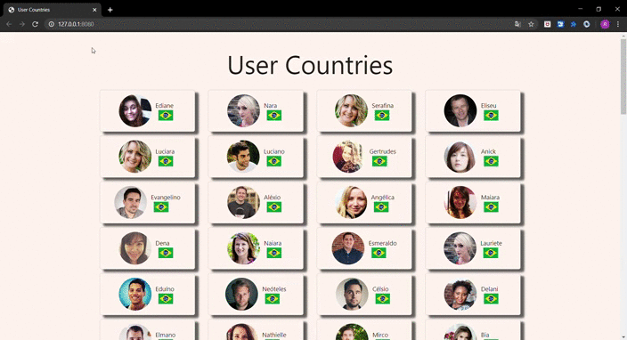

# User-Countries
---
Projeto simples, feito em JavaScript puro, tem como objetivo consumir duas apis externas, uma de usuarios outra de países, e listar na tela os usuarios juntamente com bandeira do seu país de origem.
---
# Linguagem utilizada
---
* HTML
* CSS
* Java Script
* Framework Materialize
---
# Demonstração
---
